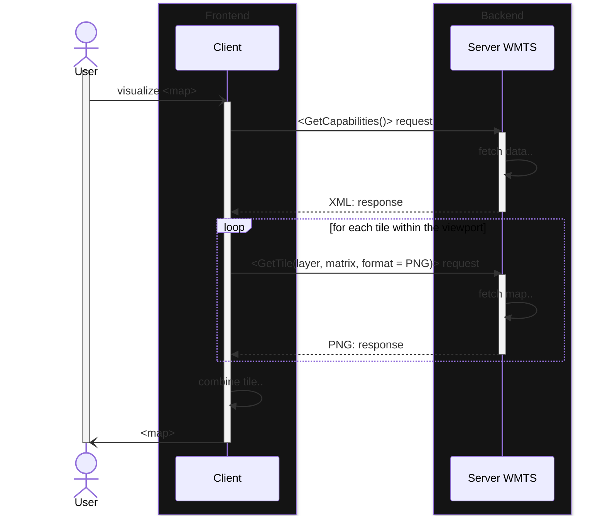

## WMTS Protocol

```mermaid
sequenceDiagram
    actor User
    box rgb(20, 20, 20) Frontend 
      participant Client
    end

    box rgb(20, 20, 20) Backend
      participant Server WMTS
    end

    activate User
      User-)Client: visualize <map>
      activate Client
        Client->>Server WMTS: <GetCapabilities()> request
        activate Server WMTS
          Server WMTS->>Server WMTS: fetch data..
          Server WMTS-->>Client: XML: response
        deactivate Server WMTS
        loop for each tile within the viewport
          Client->>Server WMTS: <GetTile(layer, matrix, format = PNG)> request
          activate Server WMTS
            Server WMTS->>Server WMTS: fetch map..
            Server WMTS -->>Client: PNG: response
          deactivate Server WMTS
        end
        Client->>Client: combine tile..
        Client-)User: <map>
      deactivate Client
    deactivate User  
```