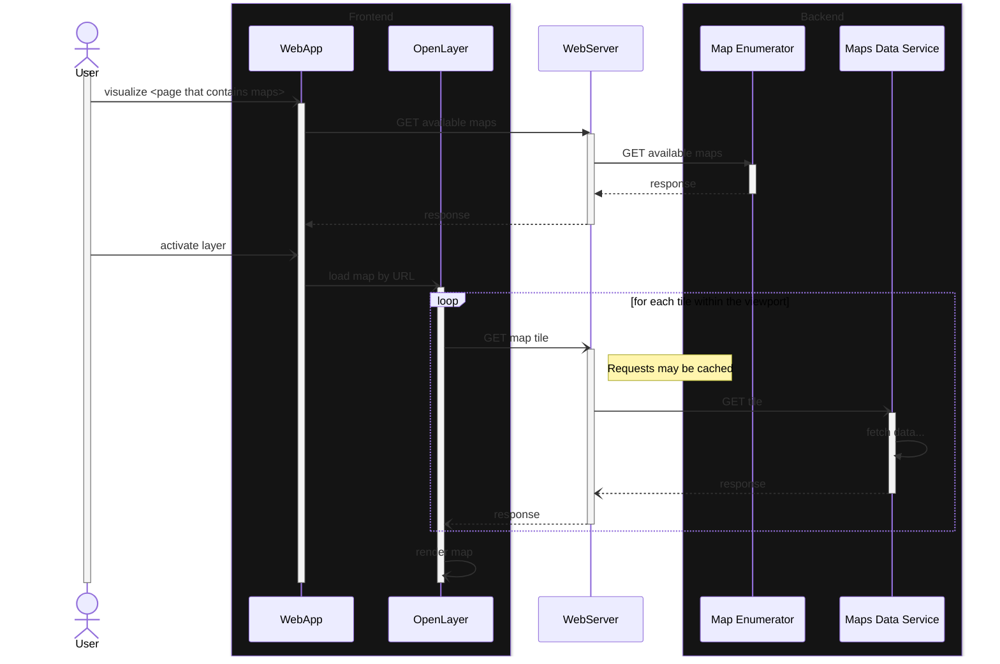
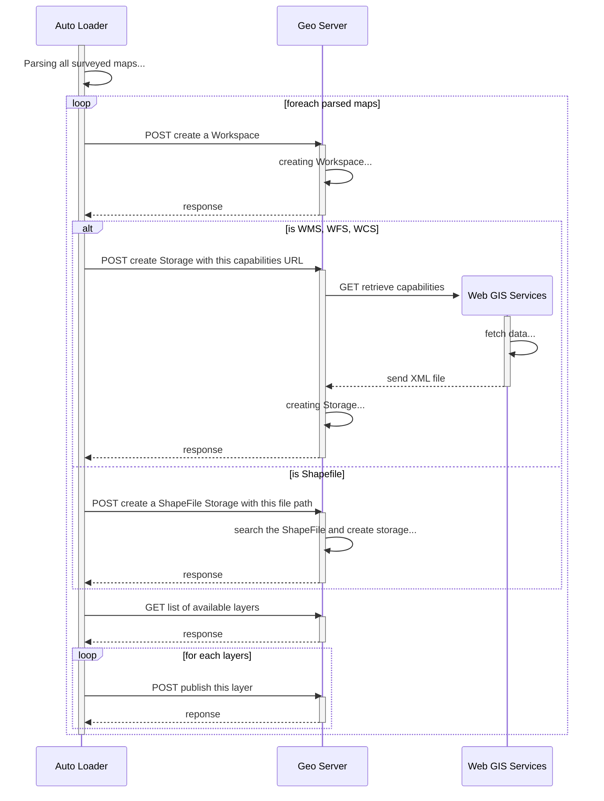

## BMS Architecture Diagram

```mermaid
sequenceDiagram
    % attiva layer e visualizza mappa

    actor User
    box rgb(20, 20, 20) Frontend 
    participant WebApp
    participant OpenLayer
    end
    participant WebServer
    box rgb(20, 20, 20) Backend
        participant Map Enumerator
        participant Maps Data Service
    end
      activate User
      User-)WebApp: visualize <page that contains maps>
      activate WebApp
      WebApp->>WebServer: GET available maps
        activate WebServer
          WebServer->>Map Enumerator: GET available maps
          activate Map Enumerator
            Map Enumerator-->>WebServer: response
          deactivate Map Enumerator
          WebServer-->>WebApp: response
        deactivate WebServer
        User-)WebApp: activate layer
          WebApp-)OpenLayer: load map by URL
          activate OpenLayer
          loop for each tile within the viewport
            OpenLayer-)WebServer: GET map tile
            activate WebServer
            Note right of WebServer: Requests may be cached
            WebServer-)Maps Data Service: GET tile
            activate Maps Data Service
            Maps Data Service->>Maps Data Service: fetch data...
            Maps Data Service--)WebServer: response
            deactivate Maps Data Service
            WebServer--)OpenLayer: response
          deactivate WebServer
          end
          OpenLayer-)OpenLayer: render map
        deactivate OpenLayer
        deactivate WebApp
      deactivate User
  
```

## BMS Autoloader Diagram

```mermaid
sequenceDiagram
    participant Auto Loader
    participant Geo Server

    activate Auto Loader
    Auto Loader->>Auto Loader: Parsing all surveyed maps...

    loop foreach parsed maps
        Auto Loader->>Geo Server: POST create a Workspace
        activate Geo Server
        Geo Server->>Geo Server: creating Workspace...
        Geo Server-->>Auto Loader: response
        deactivate Geo Server

        alt is WMS, WFS, WCS
            Auto Loader->>Geo Server: POST create Storage with this capabilities URL
            activate Geo Server
            create participant Web GIS Services
            Geo Server->>Web GIS Services: GET retrieve capabilities
            activate Web GIS Services
            Web GIS Services->>Web GIS Services: fetch data...
            Web GIS Services-->>Geo Server: send XML file
            deactivate Web GIS Services
            Geo Server->>Geo Server: creating Storage...
            Geo Server-->>Auto Loader: response
            deactivate Geo Server
        else is Shapefile
            Auto Loader->>Geo Server: POST create a ShapeFile Storage with this file path
            activate Geo Server
            Geo Server->>Geo Server: search the ShapeFile and create storage...
            Geo Server-->>Auto Loader: response
            deactivate Geo Server
        end
        Auto Loader->>Geo Server: GET list of available layers
        activate Geo Server
        Geo Server-->>Auto Loader: response
        deactivate Geo Server

        loop for each layers
            Auto Loader->>Geo Server: POST publish this layer
            activate Geo Server
            Geo Server-->>Auto Loader: reponse
            deactivate Geo Server
        end
    end
    deactivate Auto Loader
```
