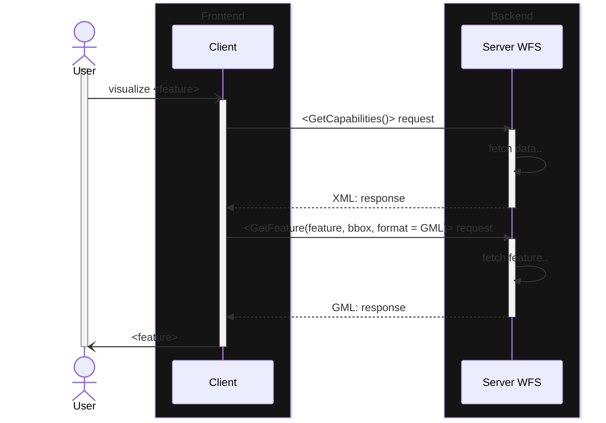

## WFS Protocol

```mermaid
sequenceDiagram
    actor User
    box rgb(20, 20, 20) Frontend 
      participant Client
    end

    box rgb(20, 20, 20) Backend
      participant Server WFS
    end

    activate User
      User-)Client: visualize <feature>
      activate Client
        Client->>Server WFS: <GetCapabilities()> request
        activate Server WFS
          Server WFS->>Server WFS: fetch data..
          Server WFS-->>Client: XML: response
        deactivate Server WFS
        Client->>Server WFS: <GetFeature(feature, bbox, format = GML)> request
        activate Server WFS
          Server WFS->>Server WFS: fetch feature..
          Server WFS -->>Client: GML: response
        deactivate Server WFS
        Client-)User: <feature>
      deactivate Client
    deactivate User  
```