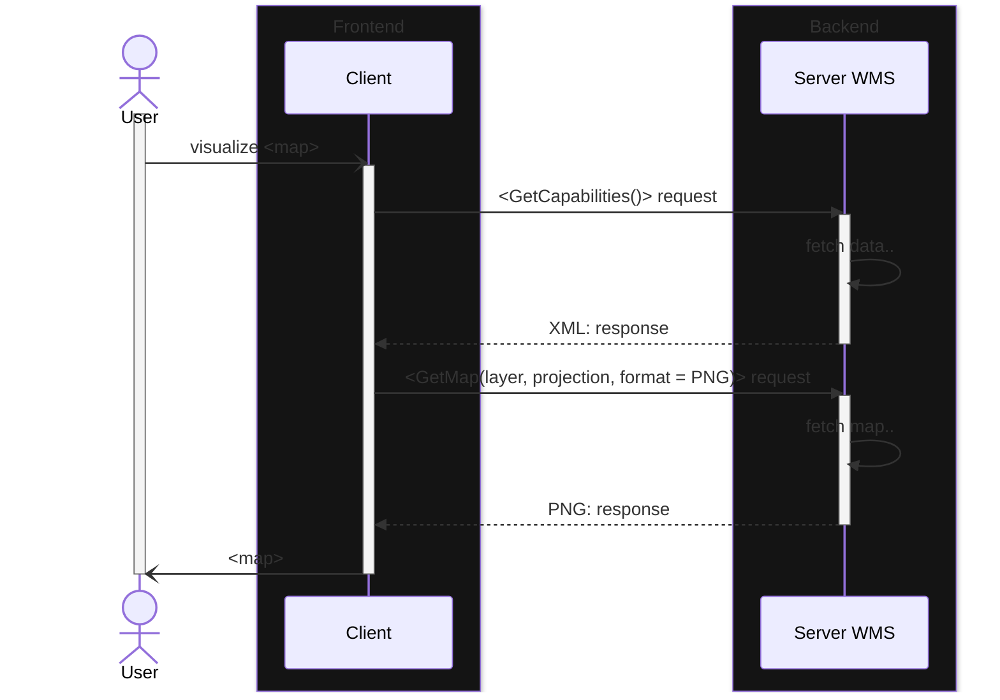

## WMS Protocol

```mermaid
sequenceDiagram
    actor User
    box rgb(20, 20, 20) Frontend 
      participant Client
    end

    box rgb(20, 20, 20) Backend
      participant Server WMS
    end

    activate User
      User-)Client: visualize <map>
      activate Client
        Client->>Server WMS: <GetCapabilities()> request
        activate Server WMS
          Server WMS->>Server WMS: fetch data..
          Server WMS-->>Client: XML: response
        deactivate Server WMS
        Client->>Server WMS: <GetMap(layer, projection, format = PNG)> request
        activate Server WMS
          Server WMS->>Server WMS: fetch map..
          Server WMS -->>Client: PNG: response
        deactivate Server WMS
        Client-)User: <map>
      deactivate Client
    deactivate User  
```